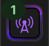
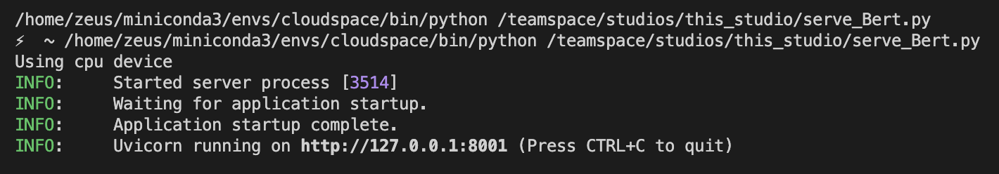

# Signs of Self

A data science bootcamp assignment.

## 0. Summary

[1. What This Is](#1-what-this-is)

&emsp;[1.1 Background](#11-background)

&emsp;[1.2 Description](#12-description)

[2. How to Use It](#2-how-to-use-it)

&emsp;[2.1 Setup](#21-setup)

&emsp;&emsp;[2.1.1 What You'll Need](#211-what-youll-need)

&emsp;&emsp;[2.1.2 Set up the Web App Itself](#212-set-up-the-web-app-itself)

&emsp;[2.2 Run That Thing](#22-run-that-thing)

&emsp;[2.3 Troubleshooting](#23-troubleshooting)

[3. Who we are](#3-who-we-are)

## 1. What This Is

### 1.1 Background

We are three data science bootcamp students who had two weeks to put together a data project and a presentation to pitch our "product" to a jury.

### 1.2 Description

## 2. How to Use It

### 2.1 Setup

#### 2.1.1 What You'll Need

- An IDE and a way to clone and push [Git](https://github.com/git-guides) repositories. \
Why an IDE: Beyond the fact that it looks nice, we use files and folders that may not be displayed properly (or at all) through a regular file navigator.
- Accounts on [Hugging Face](https://huggingface.co/), [DeepL](https://www.deepl.com/en/pro/change-plan#developer) (choose the free plan, it's more than enough), and [MistralAI](https://mistral.ai/);
- A way to deploy and run an API. We used [LightningAI](https://lightning.ai)'s API Builder feature, but any way to deploy an API and run a light LLM model should do just fine. \
Note that it may take a few days for you to get access to a free LightingAI account with 15 free credits. Write to LightningAI if you want a paid account now.
- If you want to try it out locally: A reasonably up-to-date version of the Python programming language on your computer.

### 2.1.2 Set up the Web App Itself

1. Log into the Hugging Face website, and click "+ New" > "Space".
2. Give your new space a name.
3. Under "Select the Space SDK", select "Docker", and leave "Choose a Docker template:" on "Blank".
4. You can choose whether you want the space to be public or private, it shouldn't matter for now.
5. Click the button to create your space, and keep the new web page you land on open.
6. In your computer's command line, navigate to the folder where you want to store the app files. \
How to do this in [Windows](https://www.supportyourtech.com/articles/how-to-navigate-to-a-folder-in-cmd-windows-10-step-by-step-guide/) and [MacOS](https://www.macworld.com/article/221277/command-line-navigating-files-folders-mac-terminal.html).
7. Go back to the web page, and follow the on-screen instructions to clone the repo. The `git clone` or `hf download` command goes in the same place you navigated to the folder in step 6.
8. You should now have a new folder where you chose, with the same name as the space you created. It already has a few files in it, but that's what you want.
9. See the "Hugging_Face_Spaces" folder in this repo you're reading now? Copy/download all its contents to the new folder on your computer. You may need to remove the README and Dockerfile files that were already in there first, since we will replace them with the nifty new ones from the "Hugging_Face_Spaces" folder.
10. Go back to your command line (where you ran the `git clone` or `hf download` command) and run this command: `git add . && git commit -m "$(date)" && git push`. This should put the project files in your new space, and it will automatically try to run them. However it won't work quite yet.
11. Go back to your browser, and click the "Settings" tab in the upper right-hand side of the page with the app trying to run. Scroll down all the way to "Variables and secrets" and add three secrets by pressing the "New secret" button. Secrets here are basically secret values that are stored in a way nobody can read (even you!), but that can be accessed by the code. Here are the secrets you need to set, with the exact same names:
    - Name: MISTRAL_API_KEY \
    Get the value [here](https://console.mistral.ai/api-keys) by opting to create a new API key.
    - Name: DEEPL_AUTH_KEY \
    Get the value [here](https://www.deepl.com/en/your-account/keys).
    - We'll set two others later on called "BERT_API_URL" and "BERT_API_TOKEN". This is for an API you'll set up in the next steps. If you haven't got that far yet, you can skip these for now.
12. If you have a preferred way of setting up an API, you can skip the remaining steps and set it up yourself to connect the project in the "LightningAI" folder to it. You will need to generate the scoring model yourself where the API will be running, by running "bert_finetune_ocean.ipynb". Let @AengusBl know if you have issues. \
13. Log into the LightningAI website, create a new teamspace by clicking the "+" sign next to "Teamspaces", and then click on "New Studio".
14. Once your LightningAI studio is up and running, upload the files that are in the "LightningAI" folder of this here repository to your new LightningAI studio.
15. Press the  button at the top right-hand corner of the interface, and enter and run the following command in the command line that pressing the button opened: `pip install -r requirements.txt`.
16. Open "bert_finetune_ocean.ipynb" and press "Run All".
17. On the bar at the very right-hand edge of the LightningAI webpage, press the "+" button, click "Serving", and click "Install" next to "API builder".
18. Leave the plugin window, and click  above the "+" button.
19. Press the "New API" button. Give your API a name, type "8001" under port, and select "Token" under "Authentication type".
20. Choose an API token for your API. This is like a password that will allow you to use the API and keep others from doing so without being authorised. This can be anything you want, but keep it written somewhere because you'll need it in the next step. Click "Enable".
21. Do exactly as you did in step 11, but this time, the name is "BERT_API_TOKEN" and the value is "Bearer", then one space, and then the exact text of the token you defined previously.
22. Go back to the API builder in LightningAI, click the name of the API you created, and copy the full GET API URL you are shown. Keep that web page open, we'll need it again.
23. Do exactly as you did in step 11, but this time, the name is "BERT_API_URL" and the value is the URL you copied.
24. Back where you found the URL, click "Settings", and toggle "Auto start".
25. Set the value of the on-start command to `python3 serve_Bert.py`, and make sure the auto-start is set to use a CPU rather than a GPU.
26. Go back to the Hugging Face space you first ran in step 10. If it isn't working yet, press the three dots next to "Settings" in the upper right-hand corner of your space, and select "Restart Space".
27. You should now be able to use the web app. Get a public link to the app by pressing the same three dots as in step 26, selecting "Embed this Space", and copying the direct URL.


### 2.2 Run That Thing

Running the web app should be as simple as setting it up and letting it do its thing, but you may sometimes need to go to your space in Hugging Face Spaces and reactivate it. This happens if the app doesn't see any use for some time.

### 2.3 Troubleshooting

- This web app uses a lot of APIs, which makes it more error-prone than self-contained scripts. Issues are likely to arise from mistakes in the keys given as "Secrets" in step 11 of the setup instructions, or simply from connection issues.
- Check that the "serve_Bert.py" file in LightningAI can actually run properly by clicking it to open it, and pressing the play button in the upper right-hand corner of the interface. The logs displayed in the command line should look like this: \
 \
If LightningAI says that the port is already in use, click  and remove all the lines shown. It should now work fine.
- If you wish to run the script from Hugging Face on your computer, follow the instructions below:
  1. In the command line, run `pip install dotenv` and `pip install
  2. Create a new folder and copy the files from the "Hugging_Face_Spaces" folder into it
  3. In the new folder, add the following lines to the top of app.py and llm_calls.py:
    ```python
    from dotenv import load_dotenv

    load_dotenv()
    ```
  4. In your IDE (this is important), create a new file named ".env" in the same folder you just created. It should contain the following:
    ```
    MISTRAL_API_KEY= your mistral API key here
    DEEPL_AUTH_KEY= your DeepL key here
    BERT_API_TOKEN= the API key you created yourself here
    BERT_API_URL= the URL for the API you created here
    ```
  5. Run "app.py".

## 3. Who we are

<a href="https://github.com/AengusBl/signs-of-self-dsfsft35/graphs/contributors">
  
</a>

*Made with [contrib.rocks](https://contrib.rocks).*